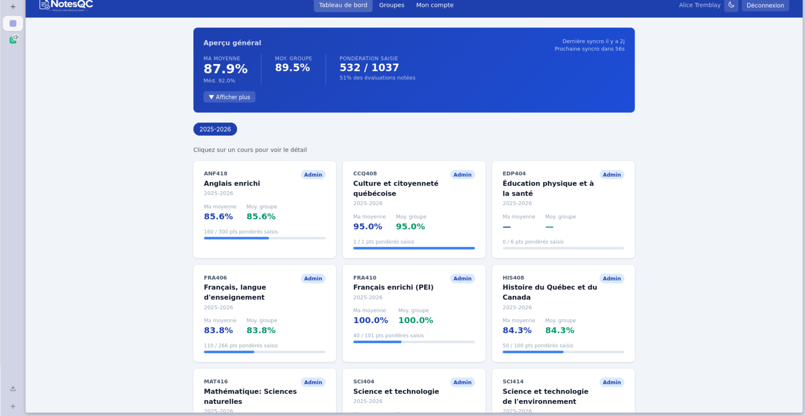
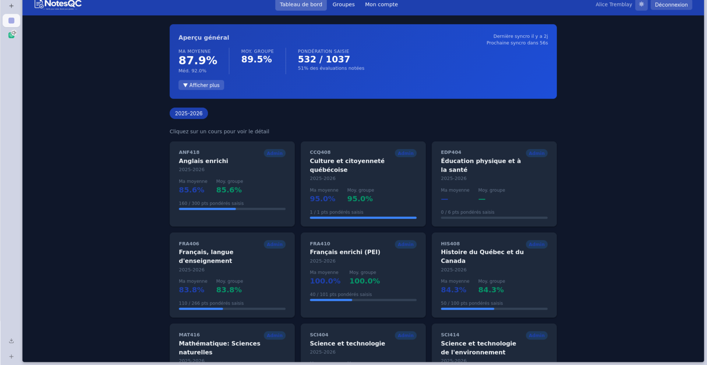
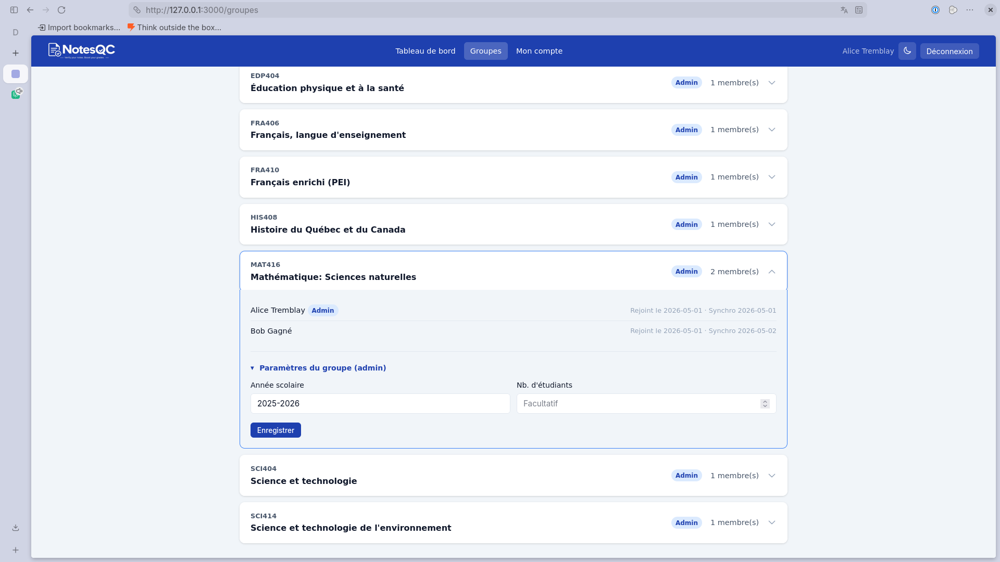
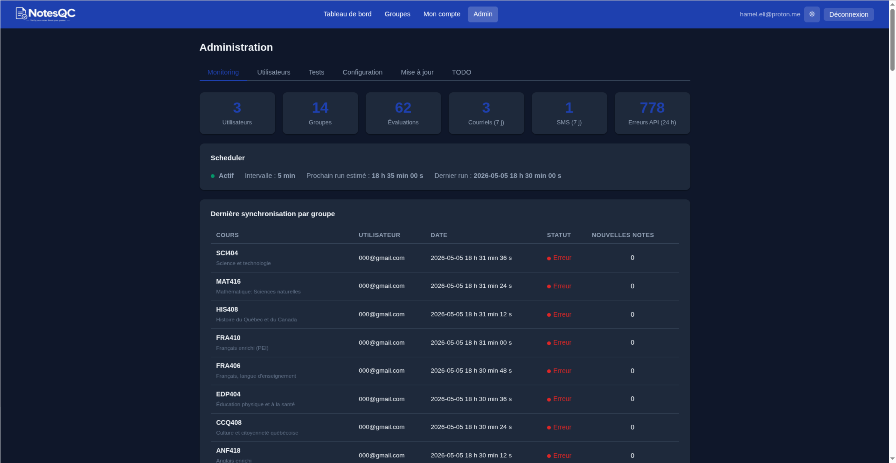
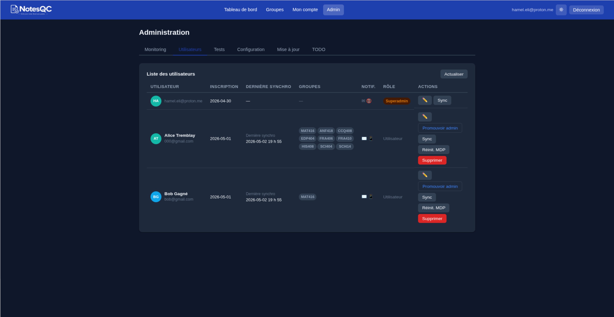
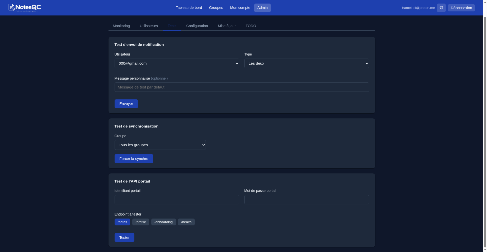

# NotesQC

A grade-tracking web app for students at Collège Esther-Blondin. Students link their school portal credentials, the backend periodically fetches their grades, and they can compare results against anonymized group averages and medians.

> **Note:** Grade fetching relies on [coba-api](https://github.com/MivraMe/coba-api), a separate project that wraps the school portal API. `PORTAL_BASE_URL` must point to a running instance of it.

## Screenshots

**Dashboard**

| Light theme | Dark theme |
|---|---|
|  |  |

| Groups | Admin – Overview |
|---|---|
|  |  |

| Admin – Users | Admin – Portal test |
|---|---|
|  |  |

## Features

### Accounts & Authentication
- Email/password registration with bcrypt hashing
- JWT-based sessions (7-day tokens)
- Password reset via email token
- **TOTP two-factor authentication** — opt-in for regular users; mandatory gate for admins (1-hour elevation window per session)

### Onboarding (5-step wizard)
1. Link school portal credentials (validated live against coba-api)
2. Import profile photo from portal with circular crop tool
3. Auto-detect and join grade comparison groups per course
4. Configure email and SMS notification preferences
5. Done — redirect to dashboard

### Dashboard & Grade Stats
- Personal weighted average and median per course and globally
- Per-assignment breakdown with group average and median
- Group median hidden when group has fewer than 3 members (mathematically redundant with 2)
- Interactive time-series chart with two modes:
  - **Moyenne** — cumulative weighted running average over time
  - **Médiane** — raw per-assignment percentages over time
- School year selector to browse past years

### Groups
- One group per course per school year, auto-created on first sync
- School year determined by majority vote on assignment due dates (prevents outlier dates creating duplicates)
- Group admin can update total student count and school year
- Group detail view shows all members, join date, and last sync time

### Invitations
- **Email invitation** — targeted, single-use, 7-day expiry; sends an invitation email via Resend
- **Share link** — open, multi-use; configurable expiry (days) and max-use cap
- Invitation sender can list and revoke their own invitations
- `/rejoindre?token=...` page validates the token and pre-fills registration

### Account Settings (`Mon compte`)
- Edit display name
- Change password
- Update portal credentials (re-validates against coba-api)
- Import or clear profile photo (200×200 JPEG, drag-to-pan + zoom crop tool)
- Configure email and SMS notification preferences
- TOTP setup/enable/disable
- Admin-only toggle: require TOTP at login (vs. only for admin panel access)
- Delete account

### Notifications
- Email (Resend) and SMS (Twilio) on new grades detected
- Disabled gracefully if API keys are not set

### Automatic Grade Sync
- `node-cron` scheduler runs on a configurable interval (`REFRESH_INTERVAL_MINUTES`, default 5)
- Each tick syncs one member per group (least-recently-synced)
- If new grades are detected, all group members are synced and notified in the same pass
- Interval can be changed at runtime from the admin panel without restarting

### Admin Panel (requires TOTP gate)

#### Stats & Monitoring
- Total users, groups, assignments
- Email and SMS notifications sent in the last 7 days
- Sync errors in the last 24 hours
- Scheduler status (running, interval, next tick)
- Sync log (last 100 entries with user, group, outcome, new scores)

#### User Management
- User list with avatar, full name, email, role, groups, last sync time
- Toggle admin role per user
- Edit user (superadmin): name, email, password, phone, portal credentials, role, photo with crop tool
- Manually trigger sync for a specific user
- Send a direct message to a user (email, SMS, or both)
- Reset password (generates a temp password, optionally SMS'd to the user)
- Disable TOTP for a locked-out user
- Delete user

#### Portal Testing
- Test coba-api endpoints (`/notes`, `/profile`, `/onboarding`, `/health`) with arbitrary credentials
- Profile/onboarding responses show a profile card preview; `photo_base64` is summarized in raw JSON output

#### Configuration (superadmin)
- Edit env vars live (`APP_URL`, `PORTAL_BASE_URL`, `REFRESH_INTERVAL_MINUTES`, Resend, Twilio) — persisted to `/workspace/.env`
- Changing `REFRESH_INTERVAL_MINUTES` restarts the scheduler immediately

#### Deploy (superadmin)
- Live SSE stream of `git pull && docker-compose up -d --build` running inside the container
- Requires `docker.sock` and `/opt/stacks/coba-web:/workspace` volume mounts

#### Todo List (superadmin)
- Internal task board with title, description, status, and priority (Haute / Normale / Basse)
- Admins can view; superadmins can create, edit, and delete items

## Tech Stack

| Layer | Technology |
|---|---|
| Runtime | Node.js (CommonJS, no build step) |
| Framework | Express 4 |
| Database | PostgreSQL 16 via `pg` |
| Auth | JWT (7-day), bcrypt (12 rounds), TOTP via `speakeasy` |
| Encryption | AES-256-CBC (`ENCRYPTION_KEY`) |
| Notifications | Resend (email), Twilio (SMS) |
| Scheduler | `node-cron` |
| Frontend | Vanilla JS + HTML (no bundler) |
| Deployment | Docker Compose |
| Grade API | [coba-api](https://github.com/MivraMe/coba-api) |

## Project Structure

```
backend/
  src/
    index.js              # Entry point
    db/
      index.js            # pg Pool + initDb()
      schema.sql          # All DDL (idempotent, IF NOT EXISTS)
    middleware/
      auth.js             # requireAuth / requireAdmin / requireSuperAdmin / requireRegularUser
    routes/
      auth.js             # /api/auth — register, login, me, forgot/reset password
      onboarding.js       # /api/onboarding — 5-step wizard
      dashboard.js        # /api/dashboard — grades, averages, charts
      groups.js           # /api/groupes — group membership
      account.js          # /api/compte — profile, password, photo, TOTP, notifications
      invitations.js      # /api/invitations — email invitations + share links
      admin.js            # /api/admin — stats, users, sync, config, deploy, todo
    services/
      crypto.js           # AES encrypt/decrypt
      portalApi.js        # coba-api HTTP client
      dataSync.js         # Sync logic + notifications
      scheduler.js        # node-cron wrapper
      notifications/
        email.js          # Resend integration
        sms.js            # Twilio integration
    public/               # Static frontend (HTML/CSS/JS, no bundler)
```

## Getting Started

### Prerequisites

- Docker and Docker Compose
- A running [coba-api](https://github.com/MivraMe/coba-api) instance
- A `.env` file (see [Environment Variables](#environment-variables))

### Generate secrets

```bash
openssl rand -hex 32   # use output for JWT_SECRET
openssl rand -hex 32   # use output for ENCRYPTION_KEY
```

### Run with Docker Compose

```bash
cp .env.example .env   # fill in required values
docker-compose up -d --build
```

The app is available at `http://localhost:3000` (or `APP_PORT` if set).

### Development (without Docker)

```bash
cd backend
npm install
npm run dev   # nodemon — auto-restarts on changes
```

## Environment Variables

| Variable | Required | Notes |
|---|---|---|
| `DATABASE_URL` | Yes | Full PostgreSQL connection string |
| `JWT_SECRET` | Yes | Min 32 chars random string |
| `ENCRYPTION_KEY` | Yes | Exactly 64 hex chars |
| `PORTAL_BASE_URL` | Yes | Base URL of the coba-api instance |
| `DB_PASSWORD` | Yes (Docker) | Postgres password for the `db` service |
| `ADMIN_EMAIL` | No | Auto-creates superadmin on boot |
| `ADMIN_PASSWORD` | No | Required if `ADMIN_EMAIL` is set |
| `APP_URL` | No | Public URL (used in invitation links) |
| `REFRESH_INTERVAL_MINUTES` | No | Grade sync interval (default: `5`) |
| `RESEND_API_KEY` | No | Enables email notifications |
| `SMTP_FROM` | No | Sender address for emails |
| `TWILIO_ACCOUNT_SID` | No | Enables SMS notifications |
| `TWILIO_AUTH_TOKEN` | No | — |
| `TWILIO_PHONE_NUMBER` | No | — |
| `APP_PORT` | No | Host port to expose (default: `3000`) |
| `NODE_ENV` | No | `production` by default in Docker |

## Role System

| Role | Access |
|---|---|
| `user` | Own grades, group comparisons, invitations, account settings |
| `admin` | All user routes + admin panel (requires TOTP gate every session) |
| `superadmin` | Full access — config, deploy, user edits, todo management. No access to `/compte` (TOTP managed inline in admin panel) |

## Database Migrations

`schema.sql` is the single source of truth and runs on every startup via `initDb()`. To add a column, append an `ALTER TABLE ... ADD COLUMN IF NOT EXISTS` statement at the bottom — never modify existing `CREATE TABLE` blocks.
